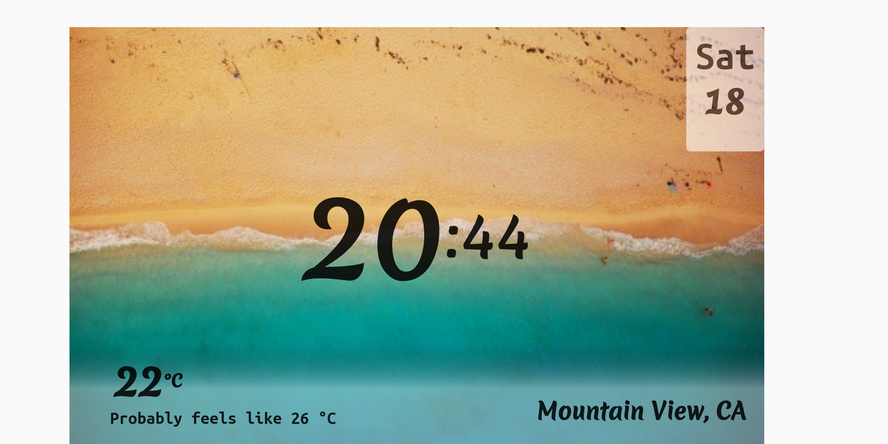

# wakati_clock

A flutter clock face UI for the Flutter [Clock Challenge](https://flutter.dev/clock#)

## Getting Started

This project is built in flutter.

cd wakati_clock  
Then type flutter run in the terminal

### Example

